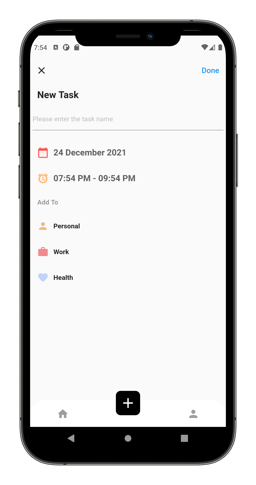
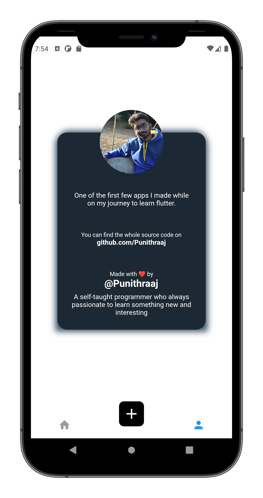

# Flutter Task Management App UI Design

Welcome to my Flutter Apps from Scratch tutorial series. In this video, we will build the task management app UI and you will learn how to build this beautiful flutter app from the scratch.

**Packages we are using:**

- dotted_border: [link](https://pub.dev/packages/dotted_border)
- persistent_bottom_nav_bar: [link](https://pub.dev/packages/persistent_bottom_nav_bar)
- hexcolor: [link](https://pub.dev/packages/hexcolor)
- intl: [link](https://pub.dev/packages/intl)
- horizontal_center_date_picker: [link](https://pub.dev/packages/horizontal_center_date_picker)
- date_picker_timeline: [link](https://pub.dev/packages/date_picker_timeline)
- timeline_tile: [link](https://pub.dev/packages/timeline_tile)

**Screens it contains:**

=> Home Screen

=> Task Details Screen

=> Add Task Screen

=> About Us Screen

Now it contains all the screen, thanks for your love and support 🙏 

## Photos

